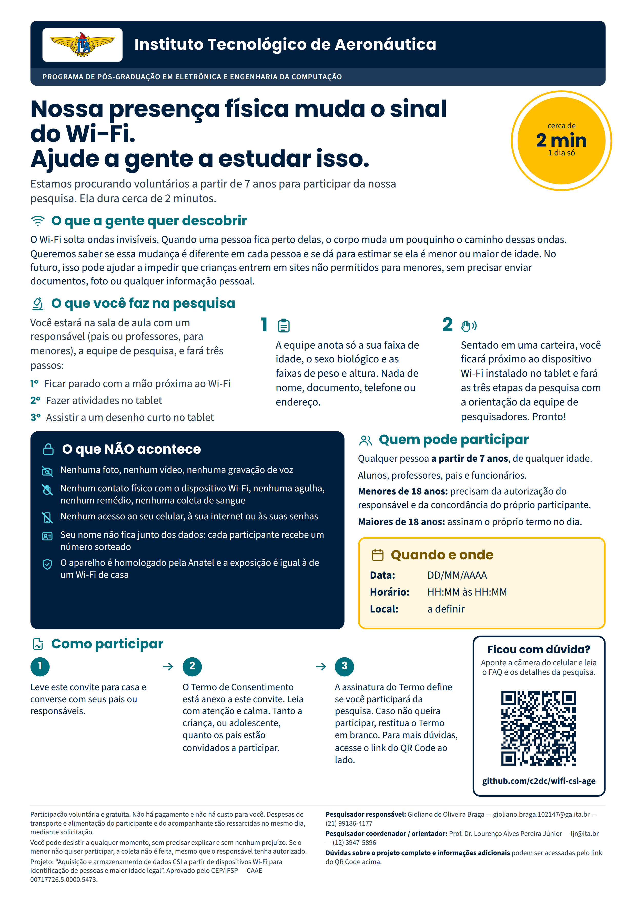

# WiAge — Wi-Fi, presença humana e verificação de idade sem dados pessoais

## Aquisição e armazenamento de dados CSI a partir de dispositivos Wi-Fi para identificação de pessoas e maior idade legal

> **Pesquisa aprovada pelo Comitê de Ética em Pesquisa do IFSP (CEP/IFSP) — CAAE nº 00717726.5.0000.5473.**
> Estamos na fase de **coleta de dados** e **procurando voluntários a partir de 7 anos**.
> Nenhum resultado foi publicado ainda. Este repositório abrigará a base de dados anonimizada e os resultados do projeto.

**Instituto Tecnológico de Aeronáutica (ITA)** · Divisão de Engenharia Eletrônica e Computação · Laboratório de Comando, Controle e Defesa Cibernética (LAB-C2) · São José dos Campos/SP

### 📄 [**Perguntas frequentes — leia antes de decidir participar**](FAQ.md)

Se você recebeu o nosso convite impresso e tem dúvidas, comece por aí. São mais de 40 perguntas respondidas em linguagem simples, feitas para participantes, pais, responsáveis e professores.

---

## Sobre o projeto

Sinais de Wi-Fi são ondas eletromagnéticas que se propagam pelo ambiente. Quando uma pessoa se posiciona próxima a um receptor, o seu corpo altera a forma como esse sinal chega à antena. Essas alterações são registradas em um conjunto de medidas chamado **Informação do Estado do Canal** (CSI, do inglês *Channel State Information*), que descreve amplitude e fase para cada subportadora das modulações OFDM e OFDMA usadas nos padrões 802.11n, 802.11g, 802.11ac e 802.11ax.

Este projeto investiga uma hipótese específica: a perturbação que a **palma da mão** provoca no campo-próximo de um receptor Wi-Fi carrega informação suficiente para

1. distinguir um indivíduo de outro; e
2. classificar o indivíduo como **menor ou maior de 18 anos**.

O produto principal da pesquisa é uma **base de dados anonimizada** de sinais CSI, coletada em múltiplos ambientes, hoje inexistente na literatura para essa finalidade.

### Por que isso importa

Os mecanismos correntes de autenticação — tokens, impressão digital, biometria facial, íris, voz — já possuem vulnerabilidades documentadas, e a ascensão de modelos generativos ampliou essa fragilidade.

Em paralelo, a verificação de idade em ambientes digitais tornou-se questão de política pública no Brasil e no exterior. Os métodos atuais dependem de autodeclaração ou do envio de documentos e selfies, o que implica coleta massiva de dados pessoais e cria, ele próprio, um risco à privacidade: para provar que alguém é maior de idade, hoje se exige que essa pessoa entregue muito mais informação do que a pergunta realmente demanda.

A proposta aqui investigada é um fator adicional de verificação que seja, ao mesmo tempo, **sem contato**, **de baixo custo**, apoiado em **infraestrutura Wi-Fi já instalada** na maior parte das residências e escolas brasileiras, e que **dispense o registro de dados identificáveis**. Em vez de responder "quem é você", o sistema tenta responder apenas "esta pessoa é maior de idade?" — e nada além disso.

---

## 🙋 Participe da pesquisa

Estamos coletando dados e **você pode ajudar**. A contribuição de cada voluntário é o que torna esta base de dados possível.

**Quem pode participar:** qualquer pessoa **a partir de 7 anos**, sem limite superior de idade — alunos, professores, pais, responsáveis e funcionários.

**Quanto tempo leva:** cerca de **2 minutos**, em um único dia. Não há retorno, não há acompanhamento posterior.

**O que você faz:** em uma sala, acompanhado pela equipe de pesquisa (e por um responsável, no caso de menores), você realiza três passos simples:

1. ficar parado com a mão próxima ao dispositivo Wi-Fi;
2. fazer atividades no tablet;
3. assistir a um desenho curto no tablet.

**O que NÃO acontece:**

- nenhuma foto, nenhum vídeo, nenhuma gravação de voz;
- nenhum contato físico com o dispositivo Wi-Fi, nenhuma agulha, nenhum remédio, nenhuma coleta de sangue;
- nenhum acesso ao seu celular, à sua internet ou às suas senhas;
- seu nome não fica junto dos dados: cada participante recebe um número sorteado;
- o equipamento é homologado pela Anatel e a exposição é equivalente à de um Wi-Fi doméstico.

**Como participar:** leia o **Termo de Consentimento Livre e Esclarecido** que acompanha o convite, converse com a sua família, e assine apenas se quiser. A participação é **voluntária e gratuita** — não há pagamento e não há custo para você. Você pode desistir a qualquer momento, sem precisar explicar e sem nenhum prejuízo.

👉 **Antes de decidir, vale a pena ler as [Perguntas frequentes](FAQ.md).**

---

## Convite impresso



O convite acima está disponível em [`Flyer_WiAge.png`](Flyer_WiAge.png) e pode ser impresso em A4 para divulgação em escolas, murais e salas de aula.

---

## Aprovação ética

Este projeto foi submetido ao Sistema CEP/CONEP pela Plataforma Brasil e **aprovado pelo Comitê de Ética em Pesquisa do Instituto Federal de São Paulo (CEP/IFSP)**.

| | |
| --- | --- |
| **CAAE** | 00717726.5.0000.5473 |
| **Comitê responsável** | CEP/IFSP — Rua Pedro Vicente, 625, Canindé, São Paulo/SP |
| **Contato do CEP** | (11) 3775-4665 · cep_ifsp@ifsp.edu.br |

A pesquisa segue as Resoluções CNS nº 466/2012 e nº 738/2024, a Lei Geral de Proteção de Dados (Lei nº 13.709/2018) e o Estatuto da Criança e do Adolescente (Lei nº 8.069/1990).

### Como conferir a aprovação por conta própria

Você não precisa acreditar na nossa palavra. Qualquer pessoa pode verificar a validade do CAAE na Plataforma Brasil, **sem ter conta cadastrada**:

1. acesse a página inicial da [Plataforma Brasil](https://plataformabrasil.saude.gov.br);
2. no menu superior da tela, **sem fazer login**, localize a opção **"Consulta"**;
3. no menu que se abre, selecione **"Por Validade de CAAE"**;
4. informe o CAAE completo — **00717726.5.0000.5473** — e faça a busca.

Mais detalhes sobre a aprovação, os direitos do participante e os canais de reclamação estão no [FAQ](FAQ.md).

---

## Estrutura do repositório

```
wifi-csi-age/
├── Readme.md                          # este arquivo: visão geral do projeto e convite
├── FAQ.md                             # perguntas frequentes para participantes e responsáveis
├── Flyer_WiAge.png                    # convite impresso (A4), para divulgação
└── Projeto_de_Pesquisa_Detalhado.pdf  # protocolo completo submetido ao CEP/IFSP
```

| Arquivo | O que é | Para quem |
| --- | --- | --- |
| [`FAQ.md`](FAQ.md) | Mais de 40 perguntas e respostas em linguagem simples sobre a pesquisa, a coleta, a privacidade e os seus direitos | Participantes, pais, responsáveis, professores |
| [`Flyer_WiAge.png`](Flyer_WiAge.png) | Convite de uma página, pronto para impressão em A4 | Quem for divulgar a pesquisa |
| [`Projeto_de_Pesquisa_Detalhado.pdf`](Projeto_de_Pesquisa_Detalhado.pdf) | Protocolo completo: desenho do estudo, população, metodologia, análise de riscos, tratamento de dados e referências | Quem quiser conferir a pesquisa a fundo |

📘 **Projeto de pesquisa completo:** [Projeto_de_Pesquisa_Detalhado.pdf](Projeto_de_Pesquisa_Detalhado.pdf)

### Dados e resultados

A base de dados anonimizada e os resultados serão publicados **neste repositório** após a conclusão da coleta e das análises. Nada foi publicado até o momento.

---

## Equipe

| Integrante | Função | Contato |
| --- | --- | --- |
| Prof. Dr. Lourenço Alves Pereira Júnior | Orientador e coordenador do projeto | ljr@ita.br · (12) 3947-5896 |
| Gioliano de Oliveira Braga | Pesquisador responsável | gioliano.braga.102147@ga.ita.br · (21) 99186-4177 |
| Pedro Henrique dos Santos Rocha | Pesquisador assistente | — |
| Rafael Pimenta de Mattos Paixão | Pesquisador assistente | — |

**Instituição proponente:** Instituto Tecnológico de Aeronáutica (ITA), Divisão de Engenharia Eletrônica e Computação — Laboratório de Comando, Controle e Defesa Cibernética (LAB-C2).

---

## Dúvidas?

- **Sobre a pesquisa ou sobre participar:** fale com o pesquisador responsável, **Gioliano de Oliveira Braga** — gioliano.braga.102147@ga.ita.br · (21) 99186-4177.
- **Sobre os seus direitos como participante:** fale com o **CEP/IFSP** — (11) 3775-4665 · cep_ifsp@ifsp.edu.br.
- **Instância Nacional de Ética em Pesquisa (INAEP):** (61) 3315-5887 · (61) 3315-5879 · inaep@saude.gov.br

Veja também as [Perguntas frequentes](FAQ.md).
